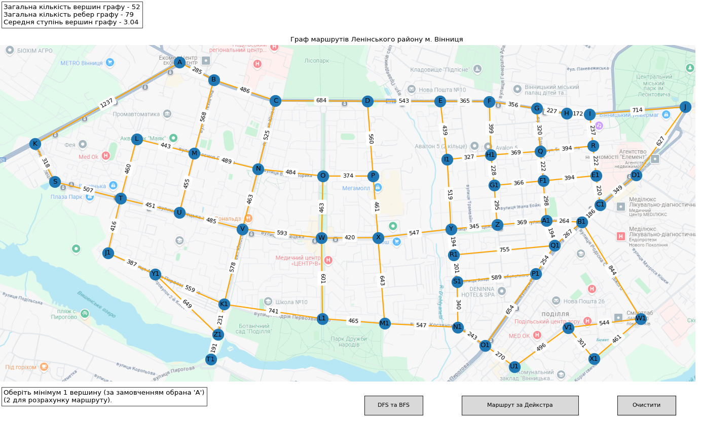
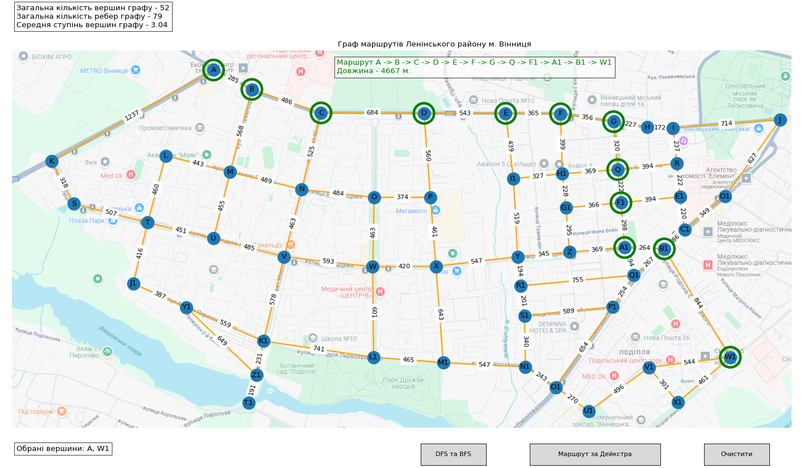

# Graphs HomeWork Module 6 Neoversity

<h3>Завдання 1</h3>

Створіть граф за допомогою бібліотеки <b>networkX</b> для моделювання певної реальної мережі (наприклад, транспортної мережі міста, соціальної мережі, інтернет-топології).

Візуалізуйте створений граф, проведіть аналіз основних характеристик (наприклад, кількість вершин та ребер, ступінь вершин).

<h3>Завдання 2</h3>

Напишіть програму, яка використовує алгоритми DFS і BFS для знаходження шляхів у графі, який було розроблено у першому завданні.

Далі порівняйте результати виконання обох алгоритмів для цього графа, висвітлить різницю в отриманих шляхах. Поясніть, чому шляхи для алгоритмів саме такі.

<h3>Завдання 3</h3>

Реалізуйте алгоритм Дейкстри для знаходження найкоротшого шляху в розробленому графі: додайте у граф ваги до ребер та знайдіть найкоротший шлях між всіма вершинами граф

## Результати

Побудовано граф на моделі вулиць райну міста Вінниця, що має наступний вигляд

За результатами використання вбудованих в бібліотеку <b>networkx</b> алгоритмів DFS і BFS отримано шляхи обходу графу. Добвжина з будьїякої вершини такого шляху є однаковою в обох алгоритмах та становить 51 крок.

За допомогою алгоритма Дейкстри наявна можливість обчислення найкоротшого маршруту між будь-якими двома точками графу.

